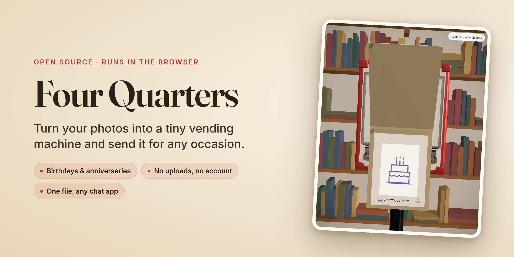
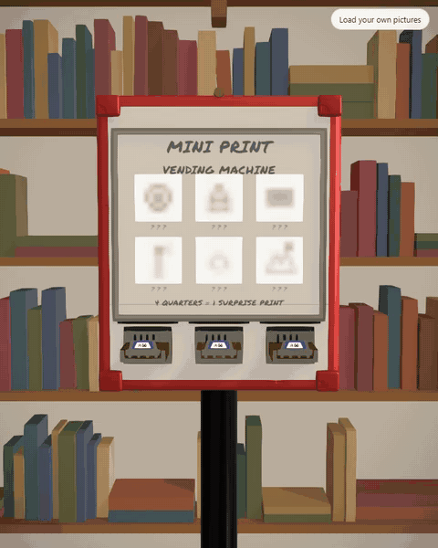
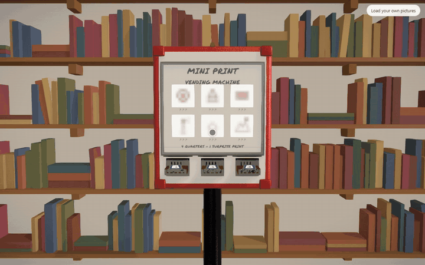

<p align="center">
  
</p>

**Turn your photos into a tiny vending machine, and send it to someone for a special occasion.**

They drop four quarters, pull the handle, and a card flies out: one of your photos on
the front, a note from you on the back. Every handle holds different cards, so they keep
feeding it quarters until they've collected them all.

<p align="center">
  
</p>

<p align="center"><b><a href="https://armanckeser.github.io/four-quarters/">Try the sample deck →</a></b></p>

Birthdays, anniversaries, Valentine's Day, graduations, weddings, Mother's and Father's Day,
a going-away present, a long-distance "thinking of you", or the group chat's year in photos:
anything you'd make a card for, except this one they get to play with. The sample deck is a
birthday card from J to Sam.

If Four Quarters is useful to you, starring the repo helps other people find it, and [armanckeser.com/subscribe](https://armanckeser.com/subscribe) has ways to hear about new releases.

---

## Send one in a minute

<p align="center">
  
</p>

1. **Open [the machine](https://armanckeser.github.io/four-quarters/)** and click
   **Make your own**.
2. **Drop in photos** and write something on the back of each. The machine fills up as you go.
3. **Save deck file** and send the `.quarters` file however you already send things:
   iMessage, WhatsApp, email, AirDrop. They open the site, drop the file in, and start
   feeding it quarters.

**Nothing is uploaded, ever.** There's no account and no server: photos are resized in
your browser, and the deck file is read straight off the recipient's disk. Six cards come
to about 100 KB, so it goes as an attachment. Add a passphrase to lock the file itself
(AES-GCM), and send the word by a different route than the file.

---

## Development

### Prerequisites

- Node.js 20+

### Quick Start

```bash
npm install
npm run dev            # Vite dev server (historically :5174; 5173 is often taken)
```

Open the printed URL. One-time, for full reflections:

```bash
bash scripts/get-hdri.sh   # downloads the gitignored CC0 library HDRI
```

The app degrades to explicit lights if the HDRI is absent, so this is optional.

### Commands

```bash
npm run build          # tsc -b && vite build — the correctness gate for the scene
npm run preview        # serve the production build
npm run check:deck     # round-trips the .quarters format, including hostile input
npm run check:flow     # drives the whole deck flow in a real browser (needs preview running)
```

There is no lint or unit-test suite: the scene is judged by looking at it, and
`tsc -b` is the gate. The deck format is the exception — a file someone was sent
last year has to keep opening, and nobody notices it stopped until they try.

### The part harness

`harness.html` renders one machine part in isolation, lit and orbitable, selected by query params. Prefer it over the full app when working on a single part.

```
/harness.html?part=handle&coins=0..4&status=loading|pushed_in|dispensed|sold_out
/harness.html?part=card&state=stowed|dispensed|open&flipped=true|false&print=0..5
/harness.html?part=cabinet
/harness.html?part=dispense&state=...&scrub=0..1&angle=front|side&print=<idx>
/                                             # full scene
```

Parts are registered in `src/harness/parts.tsx`.

---

## Architecture

```
four-quarters/
├── src/
│   ├── App.tsx              # owns the interaction model + both state machines
│   ├── lib/
│   │   ├── dimensions.ts    # single source of truth: all geometry, layout, animation
│   │   ├── audio.ts         # Web Audio SFX pool (outside the R3F graph)
│   │   └── textures.ts      # canvas thumbnail textures
│   ├── machine/             # CabinetBody, Handle, FoldedCardPart, backdrop, environment
│   ├── data/                # print catalogue + bundled placeholder artwork
│   ├── harness/             # isolated-part preview registry
│   └── MachineScene.tsx     # assembles the scene; presentational, driven by props
├── scripts/                 # HDRI fetch, SFX generation, contact-sheet renderer
└── public/                  # sfx, hdri, icons
```

**Single source of truth.** All geometry, world positions, layout, fonts, and animation parameters live in `src/lib/dimensions.ts`, modeled at 1 unit = 1 meter against real card-vendor measurements. Everything else consumes it.

**State lives in `App.tsx`.** The scene and its children are presentational. Two state machines drive it: a per-drawer mechanism (`loading → pushed_in → dispensed → sold_out`) and the open card (fly-out → unfold → rest → flip → close). The folded card eases toward one phase target at a time and only advances when that motion converges, so transforms never blend simultaneously.

**Prints cycle across handles.** The catalogue in `src/data/celebration.ts` maps print `i` to handle `i % 3`, so it can grow to any length with no per-print slot bookkeeping.

---

## Tech Stack

| Layer         | Technology                                             |
|---------------|--------------------------------------------------------|
| Rendering     | React Three Fiber (@react-three/fiber + drei)          |
| 3D            | three.js                                               |
| Audio         | Web Audio API                                          |
| Framework     | React 19, TypeScript, Vite                             |

---

## License

Released under the GNU Affero General Public License v3.0 — see [LICENSE](LICENSE). If you run a modified version where other people can reach it, the AGPL asks you to publish your changes too.

The six prints that ship with it are placeholders drawn for this repository. The machine is meant to hold your pictures, not these.
